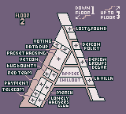
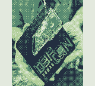
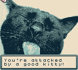

# Greetings, hackers! Welcome to defcon.

## Maps

### Floor 1a

### Floor 1b

### Floor 2

### Floor 3

SPOILERS From Here forward!

*Note: some of the QR Codes are buggy. You may get multiple when retrieving them, or you may have some disappear.*

## QR Codes

| Num  | Location | QR Code | Screenshot |
| ------------- | ------------- | ------------- |  ------------- |  
| 1 | Outside to the right before you enter |  |  |
| 2 | In Hotel Room |  |  |
| 3 | Hallway outside AI Village |  |  |
| 4 | Game hack village |  |  |
| 5 | Track 3 (see note above) |  |  |
| 6 | see note |  | same as 5 |
| 7 | see note |  | same as 5 |
| 8 | disappeared! | | |
| 9 | Hallway near XZBT |  |  | 
| 10 | Hallway far right of floor 1 |  |  |
| 11 | Track 2 Hallway far right of floor 1 |  |  |
| 12 | Defcon Groups |  |  |

**Other QR Code locations:**
- Invisible QR code in the bathroom (upper left), may or may not cause other QR codes to disappear
- CTF Village, almost always causes QR codes to disappear

## Photos
All photos are gained by correctly answering trivia questions (found below).

| Num  | Location | QR Code | Screenshot |
| ------------- | ------------- | ------------- |  ------------- |  
| 1 | Outside HDA |  |  |
| 2 | LHC |  |  |
| 3 | Packet Hacking |  |  |
| 4 | BIC Village |  |  |
| 5 | Outside Track 2 |  |  |
| 6 | Lockpick Village |  |  |
| 7 | Aerospace Village |  |  |
| 8 | AI Village | |  |
| 9 | Chillout Lounge |  |  |
| 10 | Network Bar |  |  |
| 11 | Game Hacking Village |  |  |
| 12 | Track 1 |  |  |

## Items
Some items require exchanges, some require trivia, some you get for free.

| Item  | Location | Requirement |
| ------------- | ------------- | ------------- |
| BEDAZZLED SHOE | Outside HDA | WATER |
| CRYPTO BOOK | Lost and Found | |
| DARK CHOCOLATE | Dark Tangent (see below) | Chase |
| ENERGY DRINK | Vending Machine Floor 1 | |
| KEY | HAM Village | SCREWDRIVER |
| MICROWAVE | Telecom Village | PHONE |
| PHONE | Social Engineering | BEDAZZLED SHOE |
| SANDWICH | Vending Machine Floor 1 | |
| SCREEN | Hardware Hacking | |
| SCREWDRIVER | Outside AI Village | MICROWAVE |
| SHADY BRIEFCASE | War Stories | SOLDERING IRON + SCREEN |
| SOLDERING IRON | ICS Village | Trivia |
| SOLDERING IRON | Crypto Village | CRYPTO BOOK |
| WATER | Vending Machine Floor 1 | |
| WATER | Network Bar | SHADY BRIEFCASE |

## Trivia

- What is the best selling British computer? **Raspberry Pi**
- When did Hackers come out? **1995**
- First wall of sheep? **Paper Plates**
- Who was not in Hackers? **Kevin Mitnick**
- First Hotel of DefCon: **Sands**
- What is the Blood Alcohol limit for drivers in Las Vegas? Answer: **0.08%**
- What three planes were flown by members of the Aerospace village? **Tornado, F22, E6**
- What was the very first AI village talk on? **Adversary Patches**
- What is the login for the 1985 Video Game Hacker by activision? **Australia**
- At Defcon 24 Toool debuted a new piece of equipment what was it? **WICKED WAVES**
- What doesA ICS stand for? **Industrial Control Systems**
- Who was the first CTF lead for BIC Village CTF? **Socks**
- What is the standard FTP port? **21** (or 20... *technically*...)

## Dark Tangent
You can run into the the Dark Tangent! Only one of these locations gives you a reward, and you have to chase and interact again.
- Track 2
- Hallway at the far right of Floor 1 between Crypto and Cloud Villages
- Far left hallway near Scavenger Hunt
- Floor 3 in the lower right deadend hallway (gives DARK CHOCOLATE)

## Cat Locations
The main event! When you enter the con, you are told a story in verse:

| Cat  | Location | Requirement |
| ------------- | ------------- | ------------- |
|  | Lockpick Village | Solve the puzzle! Pin order: 4213 |
|  | Car Hacking Village | Unlock the Van! Code: 1337 (heh) |
|  | Use the KEY to open the locked room top of Floor 3 all the way to the right |

## Fast Path to Finish Badge
So you just want to finish the badge and beat the game, huh? Alright, here you go!

1. Grab a WATER from the nearest vending machine on Floor 1a (hallway outside of the front entry of the Cloud Village to the left)
2. Go add Lock Cat to your party in the Lockpick Village on Floor 1a
3. Trade WATER for BEDAZZLED SHOE on Floor 1a near HDA
4. Trade BEDAZZLED SHOE for PHONE on Floor 3 in Social Eng
5. Trade PHONE for MICROWAVE on Floor 2 in Telecom
6. Trade MICROWAVE for SCREWDRIVER on Floor 1a outside AI Village
7. Trade SCREWDRIVER for KEY on Floor 3 in HAM Village
8. Add Good Kitteh to your party using KEY to unlock the further North locked room to the far right of Floor 3.
9. Add Van Cat to your party by unlocking the van on Floor 1b in the Car Hacking Village
10. Confront the Eldritch Cat God in the Vendor area with your feline friends
11. ENTER THE PORTAL

Congrats!

